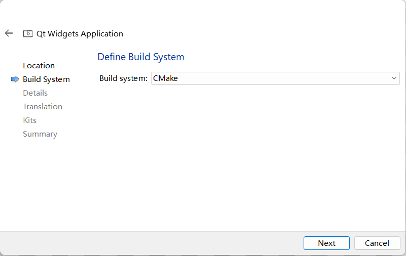

#### QT + OpenCASCADE + CMake

* 使用CMake编译[occQt: https://github.com/eryar/occQt](https://github.com/eryar/occQt) 

##### 1. mingw编译OpenCASCADE

* 安装MSYS2

* 创建`make.bat`
  
  * 在`msys2`的`bin`下（如`C:\msys64\mingw64\bin`）创建`make.bat`，内容如下：
    
    ```batch
    @echo off
    "C:\msys64\mingw64\bin\mingw32-make.exe" %1 %2 %3 %4 %5 %6 %7 %8 %9
    ```
    
    **注意：启动mingw32-make.exe的路径根据实际安装目录修改**

* 编译`OpenCASCADE`
  
  * [Windows系统使用gcc编译OpenCascade_动力蜗牛2021的博客-CSDN博客_opencascade mingw](https://blog.csdn.net/Mengxy_2021/article/details/119676485)
  
  * 准备`OOCT源码和第三方源码`
    
    
  
  * `cmake-gui`配置
    
    
    
    
  
  * 执行`make install`安装至`C:/Program Files (x86)/OCCT`
    
    

##### 2. QT项目CMakeLists.txt

1. 使用`Qt Creator`创建项目，使用`CMAKE`配置
   
   
* 参考连接：[QT 5.9.9+VSCode 开发环境搭建_cttckl的博客-CSDN博客_vscode qt](https://blog.csdn.net/cttckl/article/details/123533340)
2. `vs code`的cmake工具使用Qt安装的cmake工具，`settings.json`
   
   ```json
   {
     "cmake.cmakePath": "C:/Qt/Tools/CMake_64/bin/cmake.exe",
     "C_Cpp.default.configurationProvider": "ms-vscode.cmake-tools",
     "files.associations": {
       "qtranslator": "cpp",
       "qapplication": "cpp",
       "qmainwindow": "cpp",
       "qopenglwidget": "cpp"
     }
   }
   ```

3. 设置环境变量`QT_DIR`（`QT_DIR=C:/Qt/6.4.1/mingw_64`）

4. 设置`QT`资源文件
   
   ```cmake
   # 设置自动生成ui.h文件
   set(CMAKE_AUTOUIC ON)
   # 设置自动生成moc文件
   set(CMAKE_AUTOMOC ON)
   # 设置自动处理.qrc文件
   set(CMAKE_AUTORCC ON)
   
   set(RCC_FILES occqt.qrc)
   ```

5. 项目引入`QT`
   
   ```cmake
   find_package(QT NAMES Qt6 Qt5 REQUIRED COMPONENTS Widgets OpenGLWidgets)
   find_package(Qt${QT_VERSION_MAJOR} REQUIRED COMPONENTS Widgets OpenGLWidgets)
   ```

6. 项目引入`OpenCASCADE`
   
   ```cmake
   set(CAS_ROOT "C:\\Program Files (x86)\\OCCT")
   set(OpenCASCADE_DIR ${CAS_ROOT}/cmake)
   find_package(OpenCASCADE REQUIRE)
   include_directories(${OpenCASCADE_INCLUDE_DIR})
   ```

7. 执行程序引入资源文件和依赖库
   
   ```cmake
   add_executable(occQT
               ${PROJECT_SOURCES}
               ${RCC_FILES}   
     )
   
   target_link_libraries(
       occQT PRIVATE 
       Qt${QT_VERSION_MAJOR}::Widgets 
       Qt${QT_VERSION_MAJOR}::OpenGLWidgets 
       ${OpenCASCADE_LIBRARIES}
   )
   ```


